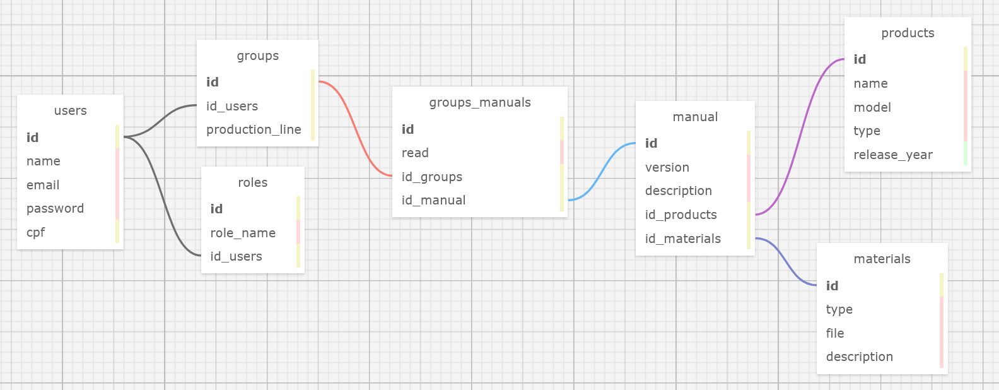

# Modelagem-BD

&nbsp;&nbsp;&nbsp;&nbsp;O modelo lógico apresentado abaixo é uma proposta de banco de dados para o projeto com a DELL. Neste repositório há também os arquivos em SQL e XML gerados pelo site SQL Designer.

  Modelo Lógico 

Fonte: Material produzido pelo autor (2024). 

## Cardinalidade

- User > Roles:
    - Relação N para 1;
    - Um usuário tem apenas um cargo atribuído a ele e cada cargo pode ser atribuído a vários usuários;
    - Chave primária: id (users);
    - Chave estrangeira: id_users presente na tabela roles;
 

- User > Groups:
    - Relação N para 1;
    - Um usuário pode estar atribuído a apenas uma linha de produção por vez e cada linha de produção pode ter vários usuários atrelados a ela;
    - Chave primária: id (users);
    - Chave estrangeira: id_users presente na tabela groups;
 

- Materials > Manual:
    - Relação N para 1;
    - Um material, seja ele um PDF, vídeo ou imagem pode estar ligado a apenas um manual e cada manual pode ter vários materiais ligados a ele.
    - Chave primária: id (materials);
    - Chave estrangeira: id_materials presente na tabela manuals;
 

- Products > Manual:
    - Relação N para 1;
    - Cada produto possui vários manuais e cada manual está ligado a apenas um produto;
    - Chave primária: id (products);
    - Chave estrangeira: id_products presente na tabela manuals;
 

- Manual > Groups:
    - Relação N para N;
    - Uma linha de produção ou usuário tem vários manuais atribuídos para leitura e cada manual pode ser atribuído para várias linhas de produção ou pessoas individualmente;
    - A tabela de associação criada para essa relação se chama "groups_manuals" e além de receber a chave estrangeira das duas tabelas ela também armazena a informação se o manual foi lido ou não pelo usuário ou linha de produção;
    - O ID de cada tabela é utilizado como chave estrangeira da tabela de associação;